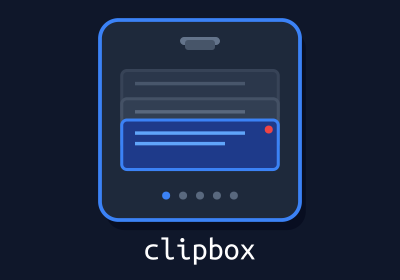

<br>

A powerful clipboard manager for Wayland with **rofi** integration, featuring multiple buffers, pinning, image preview, and password masking.

## Demo

<https://private-user-images.githubusercontent.com/29305614/523388888-c517535d-1594-42cc-a54e-e9e0d8cacea2.mp4>

## Features

- 🗂️ **5 Independent Buffers** - Organize your clipboard history across separate workspaces
- 📌 **Pin Important Items** - Keep frequently used entries at your fingertips
- 🖼️ **Image Preview** - Automatic thumbnail generation for copied images
- 🔒 **Password Masking** - Smart detection and masking of sensitive passwords
- 🎨 **Customizable UI** - Configure markers, colors, and other small details
- ⚡ **Fast operation** — Quick and responsive
- 🎯 **Rofi Integration** - Seamless keyboard-driven workflow

## Installation

### Dependencies

- `wayland`
- `wl-clipboard`
- `rofi` (optional, for rofi integration)

#### From AUR (Arch Linux)

```bash
yay -S clipbox
```

#### Build from Source

```bash
git clone https://github.com/exynil/clipbox.git
cd clipbox
go build -o clipbox
sudo mv clipbox /usr/local/bin/
```

### Set up Clipboard Watcher

Add to your window manager/desktop environment autostart:

```bash
wl-paste --watch clipbox --store
```

## Usage

<details>
<summary>Basic Commands</summary>

```bash
# Store clipboard content (usually automatic via wl-paste watch)
echo "Hello World" | clipbox --store

# List entries (usually called by rofi)
clipbox --list

# List with custom limit
clipbox --list 100

# Rebuild all previews after config changes
clipbox --rebuild-previews

# Optimize database (reclaim space)
clipbox --vacuum
```

</details>

<details>
<summary>Rofi Integration</summary>

Launch clipbox through rofi:

```bash
rofi -i -modi 'clipboard:clipbox' \
    -show clipboard \
    -show-icons \
    -kb-element-next '' \
    -kb-custom-1 'Tab' \
    -kb-custom-2 'Alt+1' \
    -kb-custom-3 'Alt+2' \
    -kb-custom-4 'Alt+3' \
    -kb-custom-5 'Alt+4' \
    -kb-custom-6 'Alt+5' \
    -kb-custom-7 'Alt+d' \
    -kb-mode-next '' \
    -kb-custom-9 'Control+Tab'
```

**Keyboard Shortcuts** (configurable in rofi config):
- `Enter` - Copy selected entry to clipboard
- `Tab` - Toggle pin on selected entry
- `Alt+1` through `Alt+5` - Switch between buffers
- `Alt+d` - Delete selected entry
- `Control+Tab` - Switch to next buffer

**Full rofi configuration example:** [exynil/dotfiles - rofi clipboard script](https://github.com/exynil/dotfiles/blob/master/rofi/.config/rofi/scripts/clipboard)

</details>

<details>
<summary>Configuration</summary>

Configuration file: `~/.config/clipbox/config.conf`

### Basic Settings

```ini
# Number of entries to display
limit=500

# Markers for pinned/unpinned entries
pinned_marker=[+]
unpinned_marker=[ ]

# Preview width in characters
preview_width=65

# Separator line length
separator_length=66
```

### Buffer Names

```ini
buffer_1_name=Work
buffer_2_name=Personal
buffer_3_name=Code
buffer_4_name=Temporary
buffer_5_name=Archive
```

### Storage Limits

```ini
# Maximum items per buffer (0 = unlimited)
max_items=500

# Minimum characters to store (ignore shorter entries)
min_store_length=0

# Maximum number of recent entries to check for duplicates
# Lower values improve performance but may allow more duplicates
max_dedupe_search=100

# Example with environment variable:
db_path=$XDG_CACHE_HOME/clipbox/clipbox.db
```

### Image Icons

```ini
# Enable/disable image thumbnails in rofi (default: false)
show_image_icons=true
```

### Password Masking

```ini
# Masking mode:
# 0 = No masking
# 1 = Partial (show first 2 and last 3 chars)
# 2 = Full (replace with [[ PASSWORD ]])
mask_passwords=1

# Mask appearance
password_mask_color=#DC2626
password_mask_char=*
```


**Password Detection Criteria:**
- Length: 8-50 characters
- No spaces or line breaks
- At least 3 character types (lowercase, uppercase, digits, special)
- Not an email, URL, or file path

**Important Note:** Password detection is not perfect and may occasionally mask non-password data that matches the criteria above. If you encounter false positives, you can disable password masking by setting `mask_passwords=0` in your config file.

### Pango Markup

You can use Pango markup in markers for colors and formatting:

```ini
pinned_marker=<span color='#DC2626'>📌</span>
unpinned_marker=<span color='#6B7280'>○</span>
```

**Note:** After changing preview-related settings (markers, width, password masking), run:
```bash
clipbox --rebuild-previews
```

</details>

<details>
<summary>Database</summary>

- **Location:** `$XDG_CACHE_HOME/clipbox/clipbox.db` (defaults to `~/.cache/clipbox/clipbox.db`, or custom path from config)
- **Icons:** Stored in `$XDG_CACHE_HOME/clipbox/icons/` (defaults to `~/.cache/clipbox/icons/`)
- **Deduplication:** Automatically prevents storing duplicate entries by checking recent entries (controlled by `max_dedupe_search` config option)

</details>

<details>
<summary>Advanced Usage</summary>

### Multiple Buffers Workflow

Use different buffers for different contexts:

1. **Buffer 1 (Work)** - Work-related clipboard items
2. **Buffer 2 (Personal)** - Personal notes, links
3. **Buffer 3 (Code)** - Code snippets
4. **Buffer 4 (Temporary)** - Quick scratchpad
5. **Buffer 5 (Archive)** - Long-term storage

Switch buffers with `Alt+1` through `Alt+5` in rofi.

### Pinning Strategy

Pin important items to keep them:
- At the end of the list for easy access
- Protected from deletion when `max_items` limit is reached
- Available across sessions

</details>

## Breaking Changes

Until we reach version 1 you should expect breaking changes from release to release. Watch the changelogs to learn about them.

We try to not introduce breaking changes that result in a definitive loss of data, but you should expect to have to redo your configuration from time to time.

---

**Star ⭐ this repo if you find it useful!**